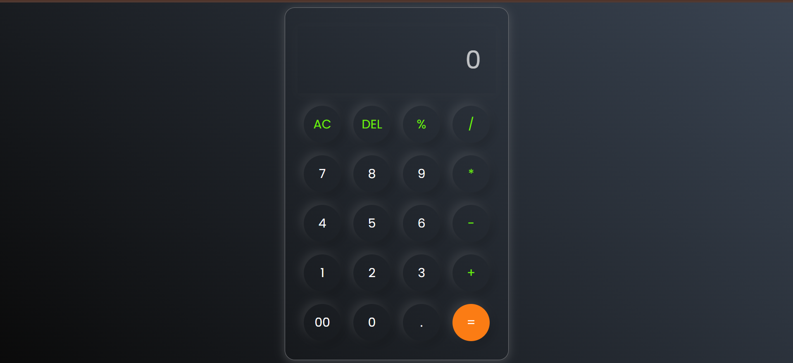

# Calculator

A simple calculator built using **HTML**, **CSS**, and **JavaScript**.  
It supports basic arithmetic operations such as addition, subtraction, multiplication, division, percentage, and clear/delete functions.

## Features
- Responsive calculator UI with modern styling
- Supports basic arithmetic operations
- AC button to clear all input
- DEL button to remove the last entered character
- Handles invalid expressions gracefully
- Interactive button hover and click effects

## Technologies Used
- **HTML** for structure
- **CSS** for styling
- **JavaScript** for calculator functionality

## How It Works
1. Numbers and operators are appended to a string when buttons are clicked.
2. The `=` button evaluates the string using JavaScript's `eval()` function.
3. `AC` clears the entire input.
4. `DEL` removes the last character.
5. Results are displayed in the input box.

## Setup Instructions
1. Clone this repository or download the files.
2. Open the `index.html` file in your browser.
3. Start performing calculations.

##Preview 

## File Structure
│── index.html # Main HTML structure
│── style.css # Styling for the calculator
│── script.js # JavaScript logic

## Future Improvements
- Add support for keyboard input
- Improve error handling without using `eval()`
- Implement advanced features like square root, power, or memory storage

## Author 
Designed and Developed by Khushi Gupta
